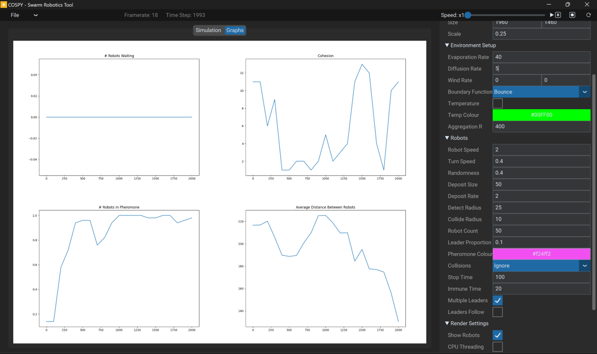

# CosPy: A simulator for swarm robotic research
Abstract – Pheromone-based communication is one of the most efficient communication methods studied in nature. We propose a novel
swarm robot simulator, ‘CosPy’, for use in swarm robotics development and research. It aims to provide a platform for the rapid
development of experiments and algorithms for mobile robots within a 2D environment. We explore the requirements of a swarm robotics
platform and how we can apply pheromone-based communication to real-world applications and environments.
Index Terms— Artificial Pheromones, Collective Behaviour, Pheromone Communication, Swarm Robotics, Simulator

## Installation 
## Getting Started
## Research
## Examples
